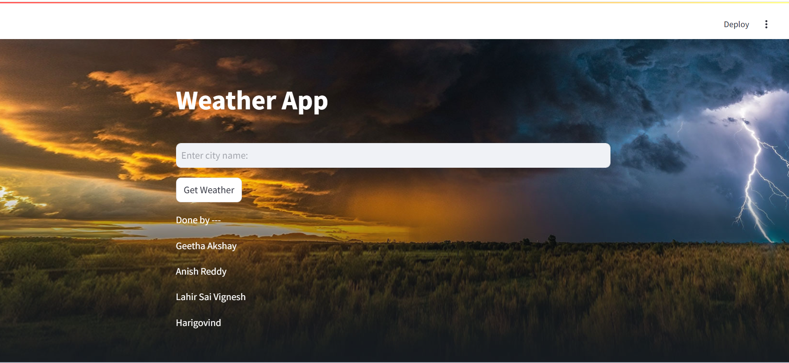
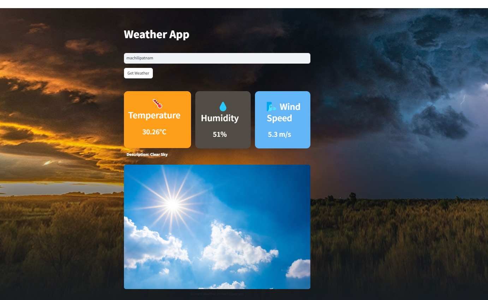

# Weather App Documentation

## Overview
This is a simple weather app built using Streamlit and Python. The app fetches real-time weather data from the OpenWeather API and displays it in an interactive UI.

## Folder Structure
```
weather_app/
│── app.py                 # Main Streamlit application
│── config.py              # Stores API key and config variables
│── requirements.txt       # Dependencies
│── README.md              # Project Documentation
│── .gitignore             # Git ignore file
│── modules/
│   │── api_handler.py     # Handles API requests
│   │── ui_components.py   # UI elements (buttons, forms, etc.)
│   │── utils.py           # Helper functions (e.g., unit conversion)
│── assets/
│   │── weather_icons/     # Icons for different weather conditions
│   │── background.png     # Background image
```

## Installation

1. Clone the repository:
   ```bash
   git clone https://github.com/your-repo/weather_app.git
   cd weather_app
   ```

2. Create a virtual environment:
   ```bash
   python -m venv venv
   source venv/bin/activate  # On Windows use: venv\Scripts\activate
   ```

3. Install dependencies:
   ```bash
   pip install -r requirements.txt
   ```

4. Run the app:
   ```bash
   streamlit run app.py
   ```

## Configuration

- The API key for OpenWeather is stored in `config.py`.
- You can replace `API_KEY` with your own key:
  ```python
  API_KEY = "your_openweather_api_key"
  ```
- For security, it's recommended to store API keys in environment variables instead of hardcoding them.

## Modules

### 1. `api_handler.py`
Handles API requests and fetches weather data.
```python
import requests
from config import API_KEY

def get_weather(city):
    """Fetch weather data from OpenWeatherMap API."""
    url = f"http://api.openweathermap.org/data/2.5/weather?q={city}&appid={API_KEY}&units=metric"
    try:
        response = requests.get(url)
        response.raise_for_status()
        return response.json()
    except requests.RequestException as e:
        print(f"Error fetching data: {e}")
        return None
```

### 2. `ui_components.py`
Defines UI elements such as background settings and weather display components.

### 3. `utils.py`
Includes helper functions such as temperature conversion:
```python
def kelvin_to_celsius(kelvin):
    """Convert Kelvin to Celsius."""
    return kelvin - 273.15
```

## Error Handling & Logging
- The API requests are wrapped in a `try-except` block to handle failures and timeouts.
- Logging can be added for better debugging:
  ```python
  import logging
  logging.basicConfig(level=logging.INFO)
  logging.info("Fetching weather data")
  ```

## Security Best Practices
- Store API keys in environment variables instead of `config.py`:
  ```python
  import os
  API_KEY = os.getenv("OPENWEATHER_API_KEY")
  ```

## Output Screenshots

### Main UI


### Results



## Contributors
- Geetha Akshay
- Anish Reddy
- Lahir Sai Vignesh
- Harigovind

## License
This project is licensed under the MIT License.

